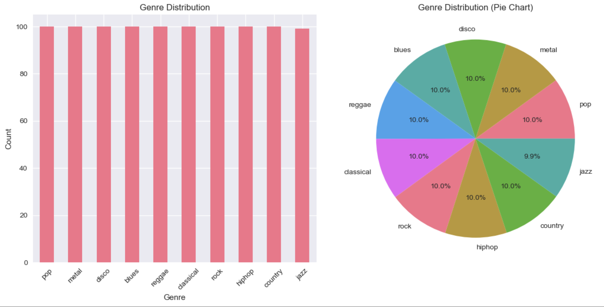

# Music Genre Classifier

This project is about building a system that can tell what genre a piece of music belongs to just by analyzing its audio. By extracting features like tempo, spectral properties, and MFCCs from songs, I trained both machine learning and deep learning (MLP) models to recognize patterns for different genres. You can either use the provided pre-extracted features for quick results, or extract your own features from new audio files to experiment and learn more about how music classification works.

You can see some results and visualizations from the project in the Results section below.

## Workflows

### 1. Pre-extracted Features (Recommended, Fastest)
- **Use when:** You want to quickly train and test the model using the provided GTZAN features.
- **Data:** Uses `data/raw/Data/features_30_sec.csv` (already included).
- **Important:** The scripts always use `data/processed/features.csv` for training and prediction. To use the pre-extracted features, copy them to this location:
  ```bash
  cp data/raw/Data/features_30_sec.csv data/processed/features.csv
  ```
- **Steps:**
  1. **Install dependencies**
     ```bash
     pip install -r requirements.txt
     ```
  2. **Train the model**
     ```bash
     python main.py --train
     ```
  3. **Predict**
     ```bash
     python src/predict.py
     ```
  4. **Train and evaluate a deep learning model (MLP)**
     ```bash
     python main.py --train --model mlp
     ```

---

### 2. Custom Feature Extraction (For Your Own Audio)
- **Use when:** You want to train on your own audio files or re-extract features.
- **Data:** Place your audio files in `data/raw/<genre>/` (example: `data/raw/rock/song1.wav`).
- **Important:** Running extraction will overwrite `data/processed/features.csv` with features from your custom audio. Back up this file if you want to keep previous features.
- **Steps:**
  1. **Install dependencies**
     ```bash
     pip install -r requirements.txt
     ```
  2. **Extract features from your audio**
     ```bash
     python main.py --extract
     ```
  3. **Train the model on your features**
     ```bash
     python main.py --train
     ```
  4. **Predict**
     ```bash
     python src/predict.py
     ```
  5. **Train and evaluate a deep learning model (MLP)**
     ```bash
     python main.py --train --model mlp
     ```

**Tip:**
- Use `python main.py --full` to run extraction and training in one step for custom audio (Random Forest only by default; for MLP, run the train step with `--model mlp`).

---

## Switching Between Workflows

When you extract custom features, `data/processed/features.csv` will be overwritten. If you want to switch back and forth between the pre-extracted features and your own custom features, use the following commands to back up and restore feature files:

- **Back up your custom features before switching:**
  ```bash
  mv data/processed/features.csv data/processed/features_custom.csv
  ```
- **Switch to pre-extracted features:**
  ```bash
  cp data/raw/Data/features_30_sec.csv data/processed/features.csv
  ```
- **Switch back to your custom features:**
  ```bash
  mv data/processed/features_custom.csv data/processed/features.csv
  ```

> **Note:** The scripts always use `data/processed/features.csv` for training and prediction. Make sure this file contains the features you want to use before running the scripts.
> 
> Use `cp` instead of `mv` if you want to keep a copy of the pre-extracted features in their original location.

---

## Results

- **Accuracy:** Both the pre-extracted and custom feature workflows achieve around 70% accuracy in the main training pipeline. (Note: Results may vary slightly depending on the workflow and data split.)
- **Genres:** blues, classical, country, disco, hiphop, jazz, metal, pop, reggae, rock


Below are the main results and visualizations from `notebooks/visualization.ipynb`:

### Feature Stats and Genre Distribution

```
Samples: 999
Features: 75
Genre distribution:
pop          100
metal        100
disco        100
blues        100
reggae       100
classical    100
rock         100
hiphop       100
country      100
jazz          99
```

### Bar and Pie Chart Genre Distribution



### Tempo by Genre and Spectral Centroid by Genre


### Confusion Matrix


### Feature Correlation Matrix


### Most Important Features


### Classification Report

```
Classification Report:
              precision    recall  f1-score   support

       blues       0.82      0.70      0.76        20
   classical       0.94      0.80      0.86        20
     country       0.57      0.80      0.67        20
       disco       0.50      0.55      0.52        20
      hiphop       0.79      0.75      0.77        20
        jazz       0.70      0.70      0.70        20
       metal       0.83      1.00      0.91        20
         pop       0.64      0.70      0.67        20
      reggae       0.68      0.65      0.67        20
        rock       0.58      0.35      0.44        20

    accuracy                           0.70       200
   macro avg       0.71      0.70      0.70       200
weighted avg       0.71      0.70      0.70       200
```

### Deep Learning (MLP) Results

- **Accuracy:** ~91%

### Confusion Matrix (MLP):


### Predicted Genre Distribution (MLP):


### Actual vs. Predicted Genre Distribution (MLP):


### Classification Report (MLP):

```
Classification Report (MLP):
              precision    recall  f1-score   support

       blues       0.95      0.95      0.95        22
   classical       1.00      0.96      0.98        28
     country       0.78      0.95      0.86        22
       disco       0.88      0.92      0.90        24
      hiphop       0.94      0.85      0.89        20
        jazz       0.89      0.84      0.86        19
       metal       1.00      1.00      1.00        12
         pop       0.89      0.81      0.85        21
      reggae       0.82      0.93      0.88        15
        rock       0.93      0.82      0.88        17

    accuracy                           0.91       200
   macro avg       0.91      0.90      0.91       200
weighted avg       0.91      0.91      0.91       200
```